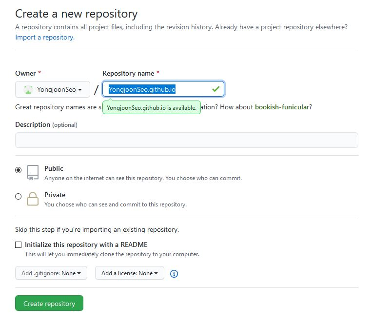

# GitHub 블로그 만들기 - Jekyll 테마 활용

## 1. GitHub page로 만들 저장소 만들기

- GitHub에서 새로운 저장소를 `{본인의 깃허브 ID}.github.io` 라는 이름으로 만들어준다.

- 과금 없이 사용하려면 저장소를 Public으로 해야 한다.

## 2. 테마 고르기

- GitHub Page를 설정할 때 Jekyll 테마를 고를 수 있다.

  

- 아래의 사이트들에서 Jekyll 테마를 고를 수 있다.
  - [jamstackthemes.dev](https://jamstackthemes.dev/ssg/jekyll/)
  - [jekyllthemes.org](http://jekyllthemes.org/)
  - [jekyllthemes.io](https://jekyllthemes.io/)
  - [jekyll-themes.com](https://jekyll-themes.com/)

## 3. 루비 & 선택한 테마 설치

1. https://rubyinstaller.org/downloads/ 에서 루비를 설치한다.

   - 터미널에서 `ruby -v` 명령어를 통해 루비 설치여부를 알 수 있다.

2. Jekyll과 bundler gems를 설치한다.

   - `gem install jekyll bundler` 

3. 로컬에 GitHub 레포지토리를 클론하고, 그 안에 선택한 테마를 설치한다.

   - 이번엔 `minimal-mistakes` 라는 테마를 선택했다. (https://github.com/mmistakes/minimal-mistakes)
   - 참고1: https://mmistakes.github.io/minimal-mistakes/docs/quick-start-guide/#remove-the-unnecessary
   - 참고2: https://mmistakes.github.io/minimal-mistakes/docs/installation/#install-dependencies

4. `_posts`라는 폴더를 만들고, 그 안에 `YEAR-MONTH-DAY-title.md`의 형식으로 마크다운을 저장한다.

   - 모든 마크다운은 [Front Matter Block](https://jekyllrb.com/docs/front-matter/)이 있어야 한다.
   - **title은 반드시 영문으로 작성되어야 한다.** (title은 이후에 url을 구성하게 된다.)

5. 빌드하고 로컬 서버에서 작동하도록 한다.

   - bundle exec jekyll serve
   - http://localhost:4000 에서 페이지를 볼 수 있다.

   

6. [테마 공식문서](https://mmistakes.github.io/minimal-mistakes/docs/configuration/)를 보며 커스터마이징 한다.

참고문서

- [honbabzone](https://honbabzone.com/jekyll/start-gitHubBlog/)
- [Dreamgonfly's blog](https://dreamgonfly.github.io/blog/jekyll-remote-theme/)
- [Minimal Mistakes](https://mmistakes.github.io/minimal-mistakes/)
- [취미로 코딩하는 개발자](https://devinlife.com/)